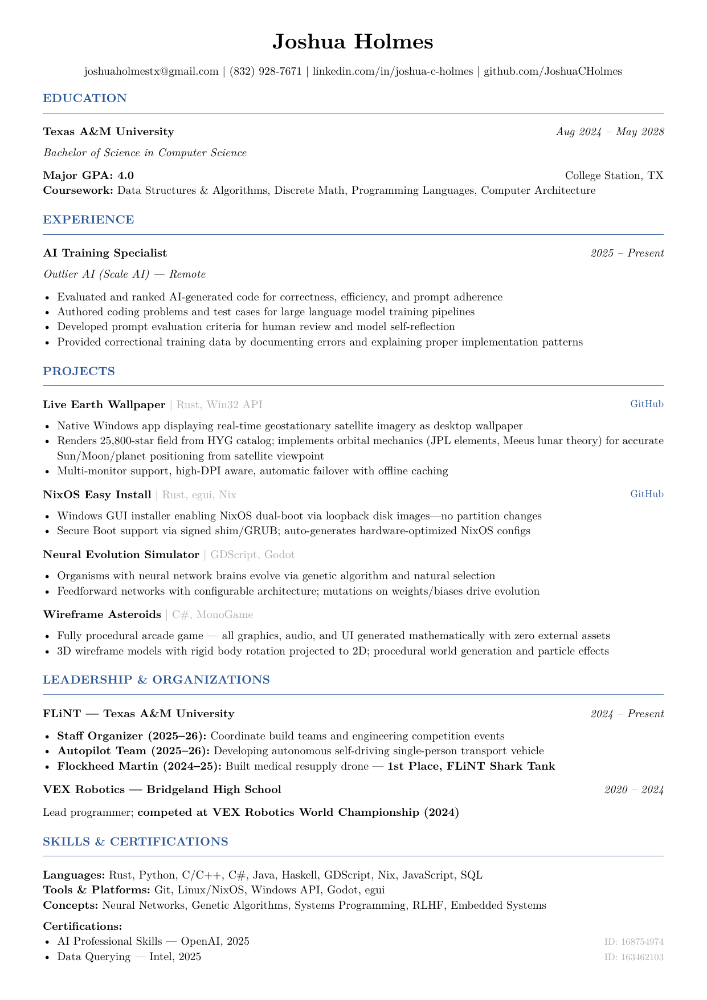

# Joshua Holmes - Resume

Professional resume built with [Typst](https://typst.app/).



## Build

```bash
cd resume
typst compile resume.typ
```

Or with nix:
```bash
nix-shell -p typst --run 'typst compile resume.typ'
```
